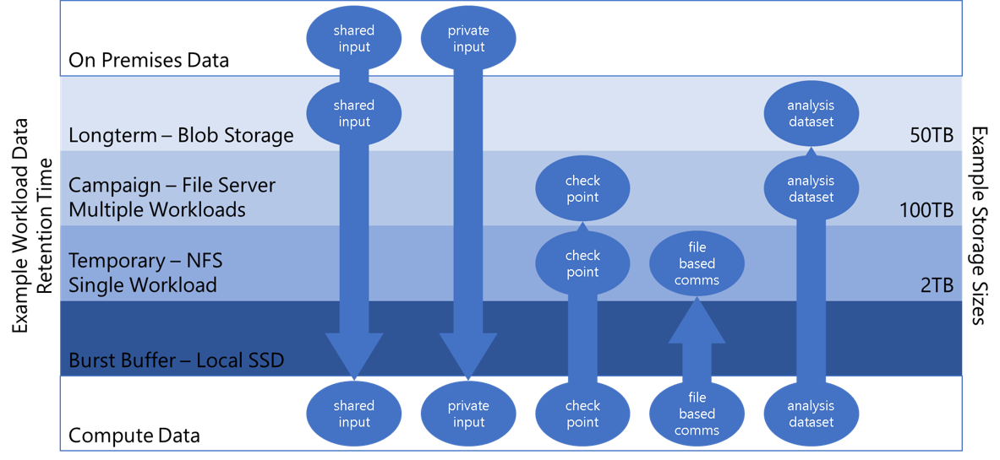
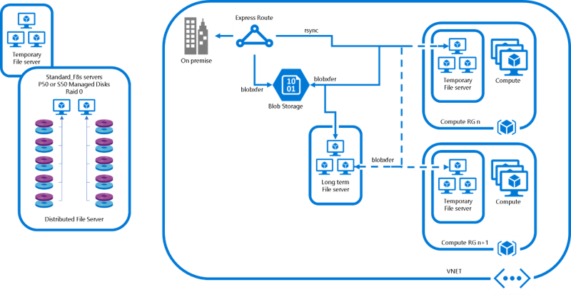

# [DRAFT] Azure HPC Cluster with Lustre attached
This repository was created for a simple configuration of an HPC cluster inside of Azure with a Lustre File System configured and mounted.

Table of Contents
=================
* [Quickstart](#quickstart)
* [Purpose](#purpose)
* [HPC in the Cloud](#deployment-steps)
* [Process](#process)
  * [Credentials](#credentials)
  * [Storage Deployment](#storage_deployment)
* [Architecture](#architecture)
  * [File System Architecture](#file-system-architecture)
  * [Estimated Costs](#estimated-monthly-cost)
* [Web Deployment](#rest-api-deployment)
  

# Quickstart
To deploy an Infiniband enabled compute cluster with a Lustre File Server attached and mounted:
1. Make sure you have quota for H-series (compute cluster) and F-series (jumpbox and storage cluster)

3. Create an Azure Service Principal for the Azure CLI. Instructions [here](#credentials)

2. Open the [cloud shell](https://github.com/MicrosoftDocs/azure-docs/blob/master/articles/cloud-shell/quickstart.md) from the Azure portal by clicking the  button on the top navigation.

3. Clone the repository, `git clone https://github.com/tanewill/azhpc_lustre`

4. Change directory to azhpc_lustre `cd azhpc_lustre`

5. Deploy the cluster `./deploy.sh [RESOURCE_GROUP_NAME] [NUM_OSS_SERVERS] [NUM_SERVER_DISKS] [NUM_COMP_NODES]`
   - For example: `./deploy.sh LUSTRETESET-RG100 4 10 5`
   - For example2: `./deploy.sh LUSTRETESET-RG100 3 3 3`
   - This example would be a file server with 4 OSS servers and 40 total disks, for 160TB and 5 compute nodes
   - The total disk size is the number of OSS Servers multipled by the number of disks per server multipled by 4TB

6. Complete deployment will take around 40 minutes

7. The connection string will be displayed upon completion of the deployment, the private rsa key will be located in the log directory that was created
   - Example connection string: `ssh -i id_rsa_lustre lustreuser@52.162.252.106`

8. OSS Server and Compute node hostips are output during the deployment, the private ssh key is located in `~/.ssh` of the jumpbox. Once connected to the compute cluster switch to user `hpcuser` using the command `sudo su hpcuser` to use the common home directory.

# Purpose
The purpose of this article is to provide an introduction to IaaS HPC and HPC storage in the cloud and to provide some useful tools and information to quickly setup an HPC cluster with four different types of storage. Lustre is currently the most widely used parallel file system in HPC solutions. Lustre file systems can scale to tens of thousands of client nodes, tens of petabytes of storage. Lustre file system performed well for large file system, you can refer the testing results for the same.

# Introduction
High Performance Computing and storage in the cloud can be very confusing and it can be difficult to determine where to start. This repository is designed to be a first step in expoloring a cloud based HPC storage and compute architecture. There are many different configuration that could be used, but this repository focuses on an RDMA connected compute cluster and a Lustre file system that is attached. Three different deployment strategies are used, a Bash script for orchastration, an Azure Resource Manager (ARM) template for the compute cluster, and Azure Batch Shipyard for the file server deployment. After deployment fully independant and functioning IaaS HPC compute and storage cluster has been deployed based on the architecture below.

# HPC in the Cloud
- HPC in the cloud continues to gain momentum. 
[Inside HPC Article](https://insidehpc.com/2017/03/long-rise-hpc-cloud/)
[The Cloud is Great for HPC](https://www.theregister.co.uk/2017/06/16/the_cloud_is_great_for_hpc_discuss/)
		
- Azure's play in the HPC space has been significant
  * Infiniband enabled hardware
  * [H-Series](https://azure.microsoft.com/en-us/blog/availability-of-h-series-vms-in-microsoft-azure/)
  * [Massive HPC deals at financial services institutions, Oil and Gas companies, etc](https://www.forbes.com/sites/alexkonrad/2017/10/30/chevron-partners-with-microsoft-in-cloud/)
  * [Cray offering](https://www.cray.com/solutions/supercomputing-as-a-service/cray-in-azure)
		
- Unlike traditional HPC environments, cloud HPC environments can be created and destroyed quickly, completely, and easily in an Ad-Hoc and On Demand fashon. With large physical disks, many storage requirments can be satisified using the attached physical disks.
	
- Now with Azure enabling over 4,000 cores for a single Infiniband enabled MPI job the dataset size can potential exceed the 2TB attached Solid State Disks. With these large datasets a simple and flexible storage solution is needed.

# Process

## Storage Deployment
There are four different types of storage that will be used for this HPC cluster. Using the default configuration there is over 29TB available for this compute cluster.

 * Physically Attached Storage as a burst buffer, located at /mnt/resource on each node
 * NFS shared from the jumpbox and located at /mnt/scratch, created in the hn-setup script here: hn-setup_gfs.sh
 * GFS shared from the storage cluster mounted at /mnt/gfs, created using Batch Shipyard, link, here in create_cluster.sh
 * Three 5TB Azure Files shares mounted to the jumpbox at /mnt/lts1,/mnt/lts2,/mnt/lts3. This is a CIFS share and can be mounted to both the Windows and Linux operating systems. These Azure File shares are subject to performance limits specified here. The size can be altered by increasing the quota here: create_cluster.sh

Below is an image that attempts to visualize the needed storage structure for an example workload. The Physically attached storage is the temporary storage, the Lustre is for the 'campaign' data that supports multiple workloads, finally the Azure Files share is for long term data retention.




## Credentials
This template requires an Azure Service Principal (SP). The SP allows the nodes that are being created to login to your Azure subscription and determine the configuration of the Virtual Network in order to add nodes to the cluster as it is being created. An SP is a security identity used by user-created apps, services, and automation tools to access specific Azure resources. Think of it as a 'user identity' (login and password or certificate) with a specific role, and tightly controlled permissions to access your resources. It only needs to be able to do specific things, unlike a general user identity. It improves security if you only grant it the minimum permissions level needed to perform its management tasks. More information on Azure Service Principals can be found [here](https://docs.microsoft.com/en-us/cli/azure/create-an-azure-service-principal-azure-cli?view=azure-cli-latest)

To create an Azure Service:
1.  Open the [cloud shell](https://github.com/MicrosoftDocs/azure-docs/blob/master/articles/cloud-shell/quickstart.md) from the Azure portal by clicking the  button on the top navigation.

2. First an AD app needs to be created. Type 
   ```
   appID=`az ad app create --display-name "azclilogin" --password "azureadmin" --homepage "http://azclilogin" --identifier-uris "http://azclilogin" | grep "appId" | awk -F'"' '{print $4}'`
   ```
   - If you receive an error saying the name or identifier already exists, select a new SP name. If you receive an error that you have Insufficient privilages, speak to your Azure subscription administrator

3. Next the SP with a password needs to be created. Type `az ad sp create-for-rbac --name $appID`
   ```
   taylor@Azure:~$ az ad sp create-for-rbac --name $appID
   Retrying role assignment creation: 1/36
   Retrying role assignment creation: 2/36
   {
      "appId": "a3e9b74e-aa16-46e2-91a6-47ef57937bd5",
      "displayName": "39500d04-e637-4749-84d6-4a20cf3167ad",
      "name": "http://39500d04-e637-4749-84d6-4a20cf3167ad",
      "password": "c048762f-a17f-46c7-b8f7-d24aae7879fe",
      "tenant": "########-####-####-####-############"
   }

4. Finally update [credentials.yaml](parameters/cred_lustre.yaml) with the output information from the previous command. Use the `appId` as the `user` in the file.


# Architecture
## Example HPC Data Architecture


## Estimated Monthly Cost 
for North Central US

Estimates calculated from [Azure Pricing Calculator](https://azure.microsoft.com/en-us/pricing/calculator/)
 - Compute, 80 H16r cores
   - 5 H16 compute nodes @ 75% utilization, $5,459.81/month 
 - Storage, 256 TB
   - 1 DS3_v2 MGSMDT Server, $214.48/month
   - 8 F8s OSS Servers, $2,330.69/month
   - 64 (8/OSS Server) Premium, P50 Managed Disks. 256 TB, $31,716.20/month
   - 15 TB Azure Files, $912.63/month

Total Cost about $40,633.81/month (~$36,764.88/month with 3 year commit)

## File System Architecture

Lustre clusters contain four kinds of systems:
 * File system clients, which can be used to access the file system.
 * Object storage servers (OSSs), which provide file I/O services and manage the object storage targets (OSTs).
 * Metadata servers (MDSs), which manage the names and directories in the file system and store them on a metadata target (MDT).
 * Management servers (MGSs), which work as master nodes for the entire cluster setup and contain information about all the nodes attached within the cluster. 
   - A single node can be used to serve as both an MDS and MGS.


Note- Before setup Lustre FS make sure you have service principal (id, secrete and tenant id) to get artifacts from Azure.

# Rest API Deployment

* Deploy the Lustre MDS/MGS

  [](https://portal.azure.com/#create/Microsoft.Template/uri/https%3A%2F%2Fraw.githubusercontent.com%2Ftanewill%2Fazhpc_lustre%2Fmaster%2Ftemplates%2Flustre-master.json) 

* Deploy the Lustre OSS

  [](https://portal.azure.com/#create/Microsoft.Template/uri/https%3A%2F%2Fraw.githubusercontent.com%2Ftanewill%2Fazhpc_lustre%2Fmaster%2Ftemplates%2Flustre-server.json)

* Deploy the Lustre Clients

  [](https://portal.azure.com/#create/Microsoft.Template/uri/https%3A%2F%2Fraw.githubusercontent.com%2Ftanewill%2Fazhpc_lustre%2Fmaster%2Ftemplates%2Flustre-client.json)

